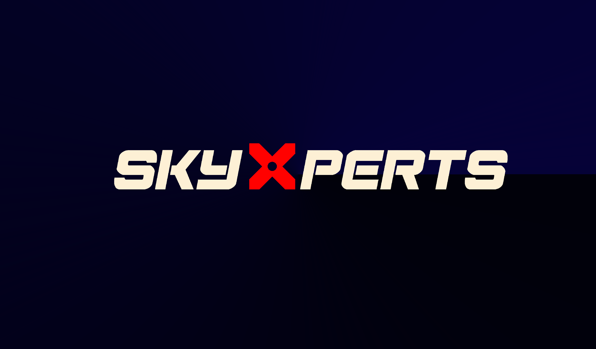

#  SkyXperts UAVs club Computer Vision training sessions.
 

  

## Prerequisites
- Git installed and working on your PC ([install guide](https://github.com/git-guides/install-git))
- GitHub account
- VS Code with Git extension (recommended)
- Python >= 3.6
- Opencv-Python
## Quick Start
1. Fork this repo to your GitHub account.
2. Clone your fork to your local PC using `git clone`.
3. Install Anaconda (or Python >= 3.6 for beginners) & OpenCV (see links below).
4. Complete tasks in the `tasks/` folder for each session.
5. After completing a task, push your solution to your own fork.
# Sessions Overview
## Session 1 :
Install Anconda and Opencv :
-  [OpenCV-Python Installation](https://web.cecs.pdx.edu/~fliu/courses/cs410/python-opencv.html)  
- [OpenCV Installation using Anaconda](https://medium.com/@pranav.keyboard/installing-opencv-for-python-on-windows-using-anaconda-or-winpython-f24dd5c895eb)

  

[Session Content](https://github.com/ffathy-tdx/SkyXperts-Vision-Course/tree/master/Session1) 
- Reading, displaying, and saving images
- Understanding image representation (pixels, color channels, image arrays)
- Performing basic image operations: resize, crop, rotate, flip
- Introduction to handling images with OpenCV functions

## Session 2:

[Session Content](https://github.com/ffathy-tdx/SkyXperts-Vision-Course/tree/master/Session2) :
    - Image acquisition techniques (cameras, sensors)
    - Image formats and color spaces
    - Converting between color spaces (BGR, grayscale, HSV)
    - Image enhancement and filtering techniques
